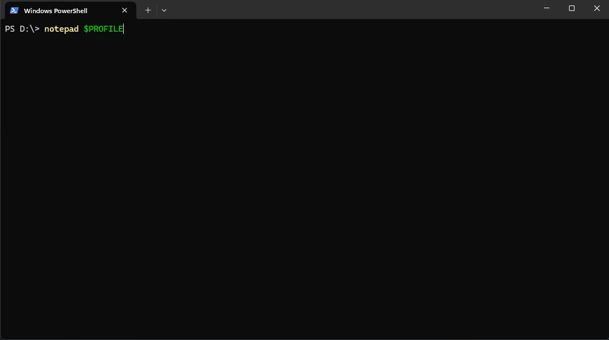

# cfolder-terminal

cfolder is a custom PowerShell function that simplifies folder management on Windows. Instead of typing long and complex commands, you can create and search folders with short, intuitive syntax.
---

Use 𝚌𝚏𝚘𝚕𝚍𝚎𝚛 -𝚑𝚎𝚕𝚙 to see the help menu.

---

##How to install it:

  -First, open your terminal and type `notepad $PROFILE`
  

  -Then, copy the code from main.ps1.

  - Paste the code into the file you opened with `notepad $PROFILE`.

  - Finally, open a new terminal and type `cfolder`.

